# APEX — Autonomous Path EXploration

[](https://github.com/sahajamoth/apex/actions/workflows/ci.yml)
[](https://github.com/sahajamoth/apex/releases/latest)
[](LICENSE)
[](docs/real-world-validation-summary.md)
[](docs/real-world-validation-summary.md)
[](https://github.com/sahajamoth/apex/actions/workflows/ci.yml)

**Find vulnerabilities. Fix coverage gaps. Automatically.**

APEX scans your codebase for security gaps, dead code, and untested branches —
then writes the tests to fix them. Single binary, 11 languages, zero config.

> **Validated against:** Linux kernel · Kubernetes · CPython · TypeScript compiler ·
> ripgrep · Spring Boot · .NET Runtime · Vapor · Rails · ktor
>
> Found a hardcoded EC private key in Kubernetes (CWE-798).
> Scanned the Linux kernel in 4 minutes. 0 crashes across 12,656 findings.

<p align="center">
  
</p>

[Full validation report →](docs/real-world-validation-summary.md)

---

## Quick Start

```bash
# Install
curl -sSL https://raw.githubusercontent.com/sahajamoth/apex/main/install.sh | sh

# Scan your project for security issues
apex audit --target . --lang python

# See coverage gaps + get auto-generated tests
apex run --target . --lang python

# CI gate — fail if coverage drops below 80%
apex ratchet --target . --lang python --min-cov 0.8
```

<details>
<summary><strong>GitHub Actions</strong></summary>

```yaml
# .github/workflows/apex.yml
name: APEX Coverage Gate
on: [push, pull_request]
jobs:
  apex:
    runs-on: ubuntu-latest
    steps:
      - uses: actions/checkout@v4
      - name: Install APEX
        run: curl -sSL https://raw.githubusercontent.com/sahajamoth/apex/main/install.sh | sh
      - name: Coverage Gate
        run: apex ratchet --target . --lang python --min-cov 0.8
```

</details>

---

## What APEX finds in real projects

```
$ apex run --target ./your-project --lang python

  ╭──────────────────────────────────────────────────╮
  │  APEX — Autonomous Path EXploration              │
  │  Target: ./your-project  (Python, 847 branches)  │
  ╰──────────────────────────────────────────────────╯

  Round 1/5 ─────────────────────────────────────────

  Coverage: 62% → 71% (+9%)
  +142 branches covered | 203 remaining | 8 tests written
```

```
  Round 5/5 ─────────────────────────────────────────

  Coverage: 71% → 94% (+23%)
  Final: 798/847 branches covered
  Tests written: 31 new tests across 6 files
```

Then ask what it learned:

```
$ /apex-intel

  ┌─ Test Optimization ──────────────────────────────┐
  │  312 tests → 94 minimal set (3.3× speedup)       │
  │  218 tests are redundant — same branch coverage   │
  └──────────────────────────────────────────────────┘

  ┌─ Dead Code ──────────────────────────────────────┐
  │  23 branches in 4 files — never executed by any   │
  │  test or production path                          │
  │                                                   │
  │  src/billing.py:89   unreachable after refactor   │
  │  src/export.py:34    legacy XML path, 0 callers   │
  │  src/api.py:201      dead error handler           │
  └──────────────────────────────────────────────────┘

  ┌─ Flaky Tests ────────────────────────────────────┐
  │  2 tests show nondeterministic branch paths       │
  │                                                   │
  │  test_concurrent_upload — race in file locking    │
  │  test_session_timeout  — depends on wall clock    │
  └──────────────────────────────────────────────────┘

  ┌─ Security ───────────────────────────────────────┐
  │  src/auth.py:67  — auth bypass: no token check    │
  │  on admin endpoint (reachable from test_api)      │
  │                                                   │
  │  src/config.py:12 — hardcoded secret:             │
  │  AWS_KEY = "AKIA..." (not from env)               │
  └──────────────────────────────────────────────────┘

  ┌─ Hot Paths ──────────────────────────────────────┐
  │  src/auth.py:45  — 12.3% of all branch hits      │
  │  src/db.py:112   — 8.7% of all branch hits       │
  │  These functions need the most test coverage.     │
  └──────────────────────────────────────────────────┘

  Deploy Score: 87/100 — GO
```

---

## Why APEX?

| | APEX | Semgrep | CodeQL | Snyk | coverage.py |
|---|:---:|:---:|:---:|:---:|:---:|
| Auto-writes tests | ✓ | — | — | — | — |
| Branch-level coverage | ✓ | — | — | — | line only |
| Security + coverage unified | ✓ | security | security | security | coverage |
| Dead code detection | semantic | — | limited | — | — |
| Deploy readiness score | ✓ | — | — | — | — |
| Single binary, zero deps | ✓ | ✓ | cloud | cloud | pip |
| 11 languages | ✓ | ✓ | ✓ | ✓ | Python |

---

## Installation

### 1. Install the APEX Binary

Pick one method:

**Standalone installer** (recommended — macOS and Linux):

```bash
curl -sSL https://raw.githubusercontent.com/sahajamoth/apex/main/install.sh | sh
```

**Homebrew:**

```bash
brew install sahajamoth/tap/apex
```

**npm:**

```bash
npx @apex-coverage/cli run --target . --lang python
```

**pip:**

```bash
pipx install apex-coverage
```

**Nix:**

```bash
nix run github:sahajamoth/apex
```

**Cargo** (from source):

```bash
cargo install --git https://github.com/sahajamoth/apex
```

Verify the installation:

```bash
apex doctor    # Check all prerequisites
apex --version # Should print v0.5.0
```

### 2. Initialize Your Project

```bash
cd your-project
apex init
```

This auto-detects your language, toolchain, venvs, and generates `apex.toml`.
No manual config needed.

### 3. Connect to Claude Code (MCP Server)

APEX ships a built-in MCP server with 33 tools. Set it up in one command:

```bash
# Auto-detect your editor and write config
apex integrate

# Or specify explicitly
apex integrate --editor claude     # Claude Code (.mcp.json)
apex integrate --editor cursor     # Cursor (.cursor/mcp.json)
apex integrate --editor windsurf   # Windsurf (~/.codeium/windsurf/mcp_config.json)

# Preview without writing
apex integrate --dry-run
```

This adds APEX as an MCP server so Claude/Cursor/Windsurf can call any APEX
command directly: coverage analysis, security audit, deploy score, etc.

<details>
<summary><strong>Manual MCP setup (if apex integrate doesn't work)</strong></summary>

Add to `.mcp.json` in your project root:

```json
{
  "mcpServers": {
    "apex": {
      "command": "apex",
      "args": ["mcp"]
    }
  }
}
```

If `apex` is not on PATH, use the full path:

```json
{
  "mcpServers": {
    "apex": {
      "command": "/usr/local/bin/apex",
      "args": ["mcp"]
    }
  }
}
```

</details>

### 4. Install APEX Agents for Claude Code

APEX ships agent definitions that Claude Code can use as specialized subagents
for coverage hunting, security detection, and code analysis.

**Option A: Install as a local marketplace plugin**

```bash
# From the APEX repo directory
cd /path/to/apex

# Register as a local marketplace
claude plugins add-marketplace ./

# Install the APEX plugin
claude plugins install apex@local
```

This registers all APEX agents (`apex`, `apex-hunter`, `apex-captain`, and
20+ crew agents) as available subagents in Claude Code.

**Option B: Copy agent files directly**

```bash
# Copy APEX agents to your project
mkdir -p .claude/agents
cp /path/to/apex/.claude/agents/apex*.md .claude/agents/

# Or fetch from GitHub
for agent in apex apex-hunter apex-captain; do
  curl -sL "https://raw.githubusercontent.com/sahajamoth/apex/main/.claude/agents/${agent}.md" \
    -o ".claude/agents/${agent}.md"
done
```

**Option C: Install from the plugin registry (if published)**

```bash
claude plugins install apex
```

<details>
<summary><strong>Available APEX agents</strong></summary>

| Agent | What it does |
|-------|-------------|
| `apex` | Orchestrator — runs the full analysis cycle (discover → hunt → detect → report) |
| `apex-hunter` | Bug hunter — writes tests targeting uncovered code, thinks adversarially |
| `apex-captain` | Planning coordinator — designs implementation plans, dispatches crews |
| `apex-crew-security-detect` | Security detector specialist — 63 detectors, 40+ CWEs |
| `apex-crew-platform` | CLI + MCP specialist — apex-cli, integration tests |
| `apex-crew-foundation` | Core types specialist — apex-core, config, coverage oracle |
| `apex-crew-exploration` | Fuzzing + symbolic specialist — apex-fuzz, apex-symbolic |
| `apex-crew-runtime` | Language runtime specialist — apex-lang, apex-instrument, apex-sandbox |
| `apex-crew-intelligence` | AI/synthesis specialist — apex-agent, apex-synth |
| `apex-crew-mcp-integration` | MCP server specialist — 33 tool definitions |
| `apex-crew-lang-*` | Per-language specialists (Python, JS, Rust, Go, Java, Ruby, C, Swift, .NET) |

</details>

### 5. Verify Everything Works

```bash
# Binary works
apex doctor

# MCP server responds
echo '{"jsonrpc":"2.0","method":"initialize","id":1,"params":{}}' | apex mcp

# Run a scan
apex audit --target . --lang python

# If agents are installed, Claude Code can use them:
# "Run /apex on this project"
# "Use the apex-hunter to find bugs in the auth module"
```

<details>
<summary><strong>Build from source with optional features</strong></summary>

```bash
# Prerequisites
rustup component add llvm-tools-preview
cargo install cargo-llvm-cov

# Clone and build
git clone https://github.com/sahajamoth/apex.git && cd apex
cargo build --release

# With optional features
cargo build --release --features "treesitter"           # tree-sitter CPG (99% accuracy)
cargo build --release --features "apex-symbolic/z3-solver"  # Z3 constraint solving
cargo build --release --features "apex-fuzz/libafl-backend" # LibAFL fuzzing engine
```

</details>

---

## Standalone CLI — 20 commands, 6 packs

<details>
<summary><strong>Core</strong></summary>

```bash
apex run --target ./project --lang python      # Coverage gap report
apex ratchet --target ./project --min-cov 0.8  # CI gate
apex doctor                                     # Check dependencies
apex audit --target ./project --lang python     # Security audit
```

</details>

<details>
<summary><strong>Pack A: Per-Test Branch Index</strong></summary>

```bash
apex index --target ./project --lang python --parallel 8
```

Runs each test individually under coverage, builds a map of test→branches.
Stored in `.apex/index.json`. Required before intelligence commands.

</details>

<details>
<summary><strong>Pack B: Test Intelligence</strong></summary>

```bash
apex test-optimize --target .                  # Minimal test subset
apex test-prioritize --target . --changed-files src/auth.py
apex flaky-detect --target . --lang python --runs 5
```

</details>

<details>
<summary><strong>Pack C: Source Intelligence</strong></summary>

```bash
apex dead-code --target .                      # Semantically dead code
apex lint --target . --lang python             # Runtime-prioritized lints
apex complexity --target .                     # Exercised vs static complexity
```

</details>

<details>
<summary><strong>Pack D: Behavioral Analysis & CI/CD</strong></summary>

```bash
apex diff --target . --base main               # Behavioral diff
apex regression-check --target . --base main   # CI gate for behavior changes
apex risk --target . --changed-files src/auth.py
apex hotpaths --target . --top 20
apex contracts --target .                      # Discover invariants
apex deploy-score --target .                   # Aggregate confidence 0-100
```

</details>

<details>
<summary><strong>Pack E: Documentation</strong></summary>

```bash
apex docs --target . --output docs/behavioral.md
```

</details>

<details>
<summary><strong>Pack F: Security</strong></summary>

```bash
apex attack-surface --target . --lang python --entry-pattern test_api
apex verify-boundaries --target . --lang python \
  --entry-pattern test_api --auth-checks check_auth --strict
```

</details>

---

## Claude Code Integration

APEX integrates natively with Claude Code for an AI-enhanced workflow.
The standalone CLI works without any AI tooling — Claude Code adds
slash commands and auto-triggered agents on top.

### Slash Commands

| Command | What it does |
|---------|-------------|
| `/apex` | **Dashboard** — deploy score, key findings, recommended next actions |
| `/apex-run` | **Autonomous loop** — measures gaps, writes tests, re-measures, repeats |
| `/apex-index` | Build per-test branch index for intelligence commands |
| `/apex-intel` | Full SDLC intelligence — test quality, risk, dead code, hotpaths, contracts |
| `/apex-deploy` | Deployment readiness — GO / CAUTION / BLOCK with confidence score |
| `/apex-status` | Coverage table for the workspace |
| `/apex-gaps` | Top uncovered regions with explanations and suggested tests |
| `/apex-generate` | Generate tests targeting uncovered branches in a crate |
| `/apex-ci 0.8` | CI gate — fails if below threshold |

### Auto-triggered Agents

These fire automatically when Claude Code detects a matching intent:

| Agent | Trigger examples |
|-------|-----------------|
| **apex-coverage-analyst** | "what's our coverage?", "which parts are uncovered?" |
| **apex-test-writer** | "write tests for X", "improve coverage in Y" |
| **apex-runner** | "run apex against Z", "run apex on itself" |
| **apex-sdlc-analyst** | "what's our deploy score?", "find flaky tests" |

### Strategy Selection

The `/apex-run` loop automatically picks the best strategy per gap:

| Target | Primary | Fallback |
|--------|---------|----------|
| Rust workspace | Source-level tests | fuzz harness |
| Python project | Source-level tests | concolic execution |
| C/Rust binary | fuzz | driller (when fuzz stalls) |
| JavaScript | Source-level tests | — |

---

## Architecture

Rust workspace, 16 crates. Heavy dependencies (Z3, LibAFL, PyO3, Inkwell,
Firecracker) are behind feature flags — not compiled by default.

| Crate | Role |
|-------|------|
| `apex-core` | Shared types, traits, config |
| `apex-coverage` | Coverage oracle, bitmap tracking, continuous branch distance heuristics |
| `apex-instrument` | Multi-language instrumentation (Python, JS, Java, Rust, LLVM, WASM) |
| `apex-lang` | Language-specific test runners |
| `apex-sandbox` | Process / WASM / Firecracker isolation |
| `apex-agent` | AI-driven test generation, priority scheduler, solver cache |
| `apex-synth` | Test synthesis via Tera templates + LLM-guided refinement loop |
| `apex-symbolic` | SMT-LIB2 constraint solving, gradient descent solver (optional Z3) |
| `apex-concolic` | Concolic execution (optional PyO3 tracer) |
| `apex-fuzz` | Coverage-guided fuzzing with MOpt (optional LibAFL) |
| `apex-detect` | Security patterns, hardcoded secrets, CWE-mapped findings |
| `apex-cpg` | Code Property Graph — taint analysis via reaching definitions |
| `apex-index` | Per-test branch indexing, SDLC analysis |
| `apex-rpc` | gRPC distributed coordination |
| `apex-mir` | MIR parsing, control-flow analysis |
| `apex-cli` | CLI binary — 20 subcommands |

### Analysis Mechanisms

APEX integrates fundamental mechanisms from established tools
(see [docs/INSPIRATION.md](docs/INSPIRATION.md) for details):

| Mechanism | From | APEX Crate |
|-----------|------|------------|
| Continuous branch distance (Korel fitness) | EvoMaster | `apex-coverage` |
| Gradient descent constraint solving | Angora | `apex-symbolic` |
| Code Property Graph + taint analysis | Joern | `apex-cpg` |
| LLM-guided test refinement (closed loop) | CoverUp | `apex-synth` |
| Priority-based exploration scheduler | Owi + EvoMaster | `apex-agent` |
| Solver caching with negation inference | Owi | `apex-agent` |

<details>
<summary>Optional feature flags</summary>

| Feature | Crate | Enables |
|---------|-------|---------|
| `llvm-instrument` | apex-instrument | LLVM-based instrumentation via inkwell |
| `wasm-instrument` | apex-instrument | WebAssembly instrumentation |
| `z3-solver` | apex-symbolic | Z3 SMT solver |
| `kani-prover` | apex-symbolic | Kani bounded model checking |
| `pyo3-tracer` | apex-concolic | Python concolic tracer |
| `libafl-backend` | apex-fuzz | LibAFL fuzzer backend |
| `firecracker` | apex-sandbox | Firecracker microVM isolation |

```bash
cargo build --release --features "apex-symbolic/z3-solver,apex-fuzz/libafl-backend"
```

</details>

---

## Configuration

```toml
# apex.toml
[coverage]
target = 1.0
min_ratchet = 0.8

[fuzz]
corpus_max = 10000
stall_iterations = 50

[agent]
max_rounds = 3

[sandbox]
process_timeout_ms = 10000
```

---

## Contributing

See [CONTRIBUTING.md](CONTRIBUTING.md) for development setup and guidelines.

Bug reports and feature requests: [GitHub Issues](https://github.com/sahajamoth/apex/issues).

## License

[MIT](LICENSE)
